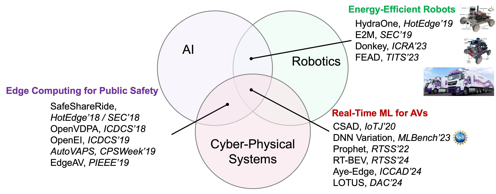

<!-- ## About Me -->

I am a Research Fellow in the [Real-Time Computing Laboratory](https://rtcl.eecs.umich.edu/rtclweb/) at the University of Michigan, working with Prof. [Kang G. Shin](https://web.eecs.umich.edu/~kgshin/) (ACM/IEEE Fellow). Previously, I received my Ph.D. in Computer Science from Wayne State University in May 2023, where I was supervised by Prof. [Weisong Shi](https://www.weisongshi.org/) (IEEE Fellow). Throughout my research career, I've had the privilege of collaborating with leading researchers from Argonne National Laboratory, General Motors, IBM Research, MIT Lincoln Laboratory, Inceptio, and Autoware.

I am also the founder of the <a href="https://liangkai.org/um-hiking/" target="_blank" rel="noopener">UMich Hiking Group</a>, a community for people who enjoy hiking and exploring the outdoors together.

<strong>[CV](../assets/pdf/CV-Liangkai_Liu.pdf) | [Research Statement](../assets/pdf/research.pdf)</strong>

## Research Focus

My research focuses on building **safe**, **predictable**, and **energy-efficient** ML systems for safety-critical **cyber-physical systems (CPS)** — from autonomous driving to robotics and beyond. I develop novel **cross-layer** systems (model/algorithms, middleware system, operating system, etc.) to achieve these goals. I'm particularly interested in:

- **Predictable ML for CPS** [[RTSS24](https://rtcl.eecs.umich.edu/rtclweb/assets/publications/2024/rtss24-liu.pdf), [ICCAD24](https://www.arxiv.org/abs/2408.05363), [DAC24](https://dl.acm.org/doi/10.1145/3649329.3657310), [RTSS22](https://weisongshi.org/papers/liu22-prophet.pdf), [MLBench23](https://arxiv.org/abs/2209.05487), [IoTJ20](https://arxiv.org/abs/2009.14349)]
- **Energy Efficient Autonomous Systems** [[TITS23](https://ieeexplore.ieee.org/document/10153345), [ICRA23](https://ieeexplore.ieee.org/document/10161110), [SEC19](https://dl.acm.org/doi/10.1145/3318216.3363302), [HotEdge19](https://weisongshi.org/hydraone/)]
- **Edge Computing for Public Safety** [[CPSWeek19](https://dl.acm.org/doi/10.1145/3313237.3313303), [PIEEE19](https://ieeexplore.ieee.org/document/8744265), [HotEdge18](https://www.usenix.org/conference/hotedge18/presentation/liu), [SEC18](https://ieeexplore.ieee.org/document/8567654), [ICDCS18](https://ieeexplore.ieee.org/document/8416394)]

<!-- <strong>I will join the Department of Computer Science at Texas Tech University as an Assistant Professor in Fall 2026. I am actively recruiting PhD students and interns — see the <a href="/openings/">Openings</a> page for details.</strong> -->

  <strong style="color: #000000;">
    I will join the Department of Computer Science at Texas Tech University as an Assistant Professor in Fall 2026. I am actively recruiting PhD students and interns — see the <a href="/openings/" style="color: #A500FF; text-decoration: underline;">Openings</a> page for details.
  </strong>

<!-- **Application Materials:** [CV](../assets/pdf/CV-Liangkai_Liu.pdf) | [Research Statement](../assets/pdf/research.pdf) | [Teaching Statement](../assets/pdf/teaching.pdf) -->

{: style="max-width:90%; height:auto;" }
