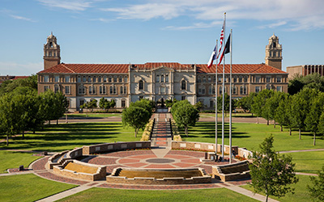
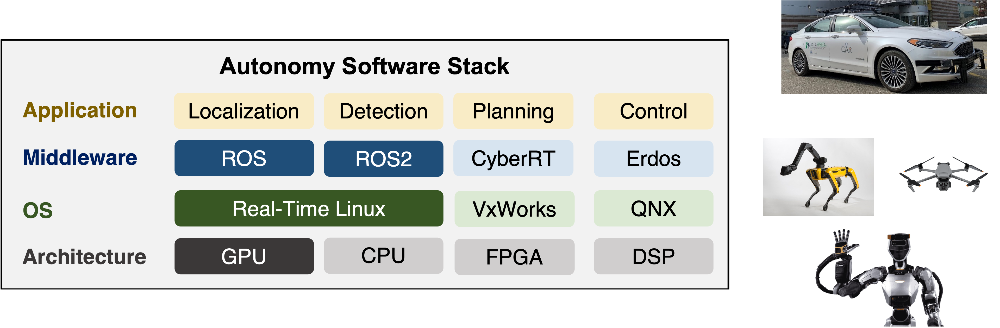

<!-- # Openings for PhDs and Interns -->

<!-- {: style="max-width:100%; height:auto; margin-bottom:30px;" } -->

I will join the Department of Computer Science at Texas Tech University as an Assistant Professor in Fall 2026. I am actively recruiting several PhD students to join my group starting in Fall 2026 and Spring 2027. My research focuses on building **safe**, **efficient**, and **predictable** AI-enabled autonomous systems, with interests spanning autonomous driving, robotics, real-time and edge AI, multimodal perception, vision-language systems, and vehicle–edge–cloud collaboration.

If you are interested in working with me, please read my [Research Statement](../assets/pdf/research.pdf) first before reaching out.

## Research Areas

My group works at the intersection of **AI, robotics, and cyber-physical systems**, with a focus on cross-layer co-design of models, runtime systems, sensing/perception pipelines, and computing platforms for mission-critical autonomy.

{: style="max-width:90%; height:auto;" }

Topics of interest include:

- **Foundation Models for Autonomy**
  - Perception, reasoning, and decision-making for AI-enabled autonomy in autonomous vehicles, robotics, and drones

- **Computing Systems for Robotics**
  - Real-time, efficient, and scalable systems support for autonomous intelligence across device, edge, and cloud

- **Physics Intelligence**
  - Physics-aware and safety-conscious autonomy for robust cyber-physical systems, including AVs, off-road platforms, AR/VR, and other emerging applications

<!-- ## Prospective PhD Students -->

<!-- Prospective Students -->
<h2 class="teaching-subheading" style="margin-top: 2.5rem;">Prospective Students</h2>

<div style="border: 2px solid #A500FF; background-color: #F8EEFF; padding: 20px 24px; border-radius: 12px; margin: 20px 0; text-align: center;">
  <p style="margin-bottom: 0.75rem;"><strong>What I look for:</strong></p>
  <ul style="text-align: left; display: inline-block; margin: 0 0 1rem 0; padding-left: 1.2rem;">
    <li>Background on Robotics, Machine Learning, Computer Vision, and Embedded Systems</li>
    <li>Programming skills (Python, C/C++)</li>
    <li>Passion for research and robotics</li>
  </ul>
  <p style="margin: 0 0 1rem 0;">
    <strong>Fully-funded RA positions</strong> with competitive stipend and tuition waiver are available.
  </p>
  <a href="https://docs.google.com/forms/d/e/1FAIpQLSea4ocykyiOsp-uoxQg72iiNcKTXn2gk3swSwZ923mYu0gCDQ/viewform?usp=dialog"
     class="cta-btn"
     target="_blank"
     rel="noopener">
    Apply via Google Form
  </a>
  <p style="margin-top: 1rem; font-size: 0.85rem; color: #666;">
    Or email your CV and research statement to
    <a href="mailto:liangkai@umich.edu" style="color: #A500FF; text-decoration: underline;">liangkai@umich.edu</a>
  </p>
</div>

<!-- I welcome applications from motivated students with backgrounds in:

- Robotics
- Cyber-Physical Systems
- Computer Engineering
- Machine Learning, Computer Vision
- Embedded Systems

Strong applicants typically have one or more of the following:

- Solid programming and system-building skills
- Prior research experience in AI, systems, robotics, or autonomous systems
- Interest in tackling real-world problems in safety-critical systems
- Publication experience or other evidence of research potential

## How to Contact Me

If you are interested in joining my group, please email me with the following materials:

1. **CV**
2. **Transcripts**
3. A brief summary of your **research interests**, **prior experience**, and **career goals**

Please use the following email subject line:

```text
[Prospective PhD] Your Name - Your University
``` -->
