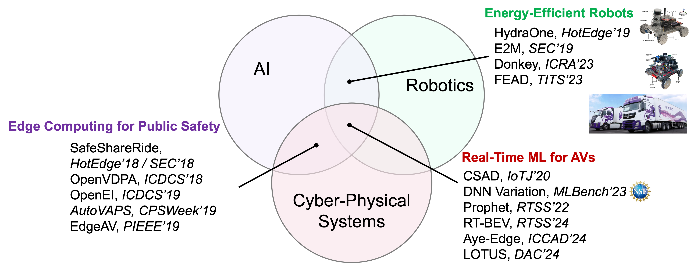
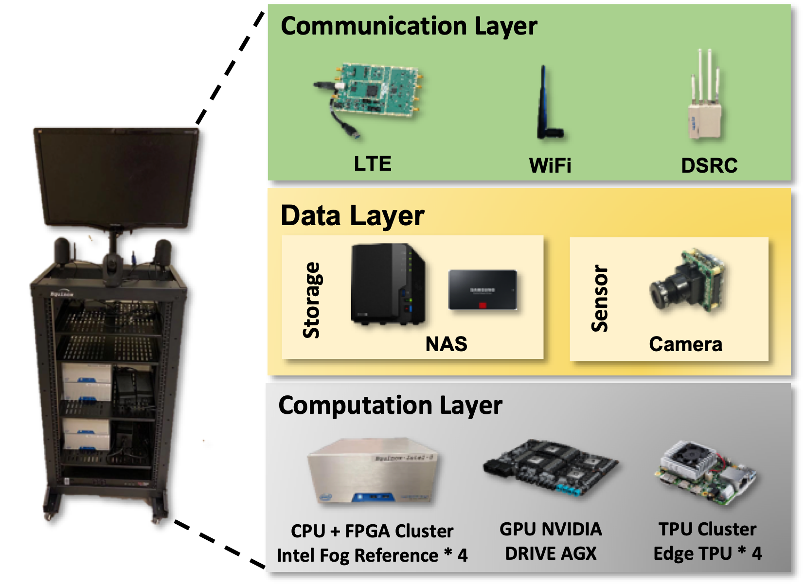

## Research Objective

My research vision is to develop **real-time cyber-physical systems** that enhance **autonomy**, **efficiency**, and **safety** in transportation and robotics. By integrating cyber-physical systems, real-time processing, and edge computing, I aim to create robust and scalable solutions to address the challenges of autonomous driving and intelligent transportation. My goal is to bridge the gap between theory and practice, ensuring that advanced transportation systems are both innovative and reliable in real-world applications.

<!-- ## Research Highlights

My research interests lie in computing systems for autonomous driving, cyber-physical systems, robotics, and edge computing. By delivering robust AI system solutions with significant societal impact, I aim to enhance the **safety**, **predictability**, and **efficiency** of **real-time cyber-physical systems**, such as autonomous vehicles, trucks, and mobile robots. My work, published in top-tier venues like RTSS, RTAS, ICCAD, ICRA, SEC, HotEdge, TITS, IWC, and IoTJ, addresses these objectives in the autonomous CPS sphere.

Notably, I was among the first in the computing systems community to explore DNN inference time variations in autonomous driving, leading to a **\$600,000 [NSF Grant](https://www.nsf.gov/awardsearch/showAward?AWD_ID=2343601&HistoricalAwards=false)** as Co-PI on multi-tenant DNN timing research. I developed testbeds like **HydraOne** and **Donkey**, programmable and energy-efficient platforms for autonomous mobile robots. My work on fuel-efficient autonomous trucking achieved a **7% reduction in fuel consumption** in real deployments compared to experienced drivers. As of December 9, 2024, my publications have over **1,960 citations**, with an **H-Index 17** and **i10-Index 20**. -->

<!-- ## Prior Research -->

### 1. Predictable Perception for AVs

Autonomous vehicles depend on sensors and deep neural networks (DNNs) to perceive their environment in real time. Ensuring predictability in the perception pipeline is challenging. My prior work spans comprehensive profiling of DNN inference time variations and novel systems to guarantee predictable perception.

#### DNN Inference Time Variations Profiling  
We built a reconfigurable testbed for fine-grained profiling of DNN inference and analyzed time variations across six dimensions: data, I/O, model, runtime, hardware, and end-to-end pipeline. This effort yielded six key insights and informed an NSF grant on multi-tenant DNN timing.

#### Prophet  
**Prophet** addresses inference time variations in multi-tenant DNNs through a two-stage approach: predicting variability from intermediate outputs (e.g., proposals, raw points) and coordinating concurrent models to align their execution progress. Demonstrated on KITTI, Prophet reduces timing jitter for safety-critical perception (IEEE RTSS 2022).

#### PP-DNN  
**Predictable Perception with DNNs (PP-DNN)** dynamically selects critical frames and regions of interest (ROIs) based on scene context and frame similarity. An ROI generator and FLOPs predictor guide an ROI scheduler across multiple models, with a detection predictor for non-critical frames. Implemented in ROS and evaluated on BDD100K and nuScenes, PP-DNN significantly improves timing predictability (Under review: RTAS 2025).

#### RT-BEV

**RT-BEV** co-optimizes message communication and object detection for real-time Bird’s-Eye-View perception. Key components include an ROI-aware camera synchronizer, context-aware ROI generator, feature split & merge for variable ROI sizes, a time predictor, and a global coordinator. Implemented in a ROS BEV pipeline and validated on nuScenes, RT-BEV delivers low-latency, high-accuracy BEV perception (IEEE RTSS 2024).

#### AyE-Edge  
**AyE-Edge** automates algorithm–device deployment for accurate, power-efficient real-time object detection on edge devices. Through joint exploration of keyframe selection, CPU–GPU configuration, and model pruning, AyE-Edge achieves up to **96.7% power reduction** in real-world mobile experiments (ICCAD 2024).

---

### 2. Energy-Efficient Autonomous Systems

Energy efficiency is critical for mobile robots and heavy-duty trucks. We built platforms and middleware to coordinate perception, planning, control, and hardware for power savings.

#### E2M  
**E2M** is an energy-efficient middleware that regulates sensor data access, adjusts process execution periods, and coordinates concurrent jobs to maximize hardware sleep time. On the HydraOne testbed, E2M achieves **24% computing energy savings**, translating to **11.5% more battery life** and **14 extra minutes** of runtime with minimal performance loss (ACM/IEEE SEC 2019).

#### Energy-Efficient Path Planning for AMRs  
Using the Donkey platform’s power profiling, we developed a real-time energy prediction model and path planning strategies. Our approach delivers **>90% prediction accuracy** and up to **44.8% energy savings** in obstacle avoidance (ICRA 2023).

#### pNav  
**pNav** jointly optimizes physical and cyber subsystems of AMRs through millisecond-level power prediction, spatial/temporal locality modeling, and dynamic coordination of software and hardware configurations. Prototyped in ROS with Donkey, pNav achieves **>96% prediction accuracy** and **38.1% power reduction** without compromising safety (Under review: EuroSys 2025).

#### FEAD  
**Fuel-Efficient Autonomous Driving (FEAD)** uses engine management and Instant Fuel Meter data collected over three months to train and compare seven fuel-rate prediction models. Deployments on Inceptio trucks demonstrate **7% fuel savings** versus human drivers (IEEE TITS 2023).

---

### 3. Vehicular Edge Computing for Public Safety

Connected and Autonomous Vehicles (CAVs) require robust computing and communication testbeds. My work spans vehicle-scale testbeds and edge-driven safety systems.

  
  

#### Hydra AV Testbed  
At Wayne State University, we built **Hydra**, a level-4 autonomous vehicle on NVIDIA Drive PX2 with six cameras, six radars, one LiDAR, GNSS, DSRC, and a drive-by-wire actuator system. A dedicated power distribution system supports the computing stack.

#### Vehicular Communication Comparison  
Integrating the **Equinox** roadside unit and HydraOne testbed, we benchmarked WiFi, LTE, and DSRC for latency, power, and utilization, guiding CAV communication design (USENIX HotEdge 2020).

#### SafeShareRide  
**SafeShareRide** is an edge-enabled ride-sharing safety system with three stages: speech recognition, driving behavior detection, and video capture/analysis. Abnormal events trigger edge video compression and cloud analysis. Implemented on smartphones, SafeShareRide won publications at USENIX HotEdge 2018 and ACM/IEEE SEC 2018.

---

<!-- ## Short-Term Goals

- **End-to-End AV Testing Methodologies**  
  Develop universal metrics and comprehensive testing pipelines covering perception to control, to identify vulnerabilities and quantify safety impacts under real-world scenarios.

- **Optimizing Foundation Models for CPS**  
  Explore software optimizations for deploying vision, language, and audio foundation models on resource-constrained devices, targeting energy-efficient inference in autonomous driving and smart healthcare.

## Long-Term Goals

- **Hardware-Software Co-Design for Efficient CPS**  
  Partner software and hardware innovations to integrate foundation models into CPS, ensuring high performance and low energy consumption for real-time inference and training.

- **Advancing Off-Road Autonomous Driving**  
  Design vehicles and sensor suites (including drones) for unpredictable off-road environments, enabling robust, real-time perception and control in agriculture, disaster response, and exploration. -->

